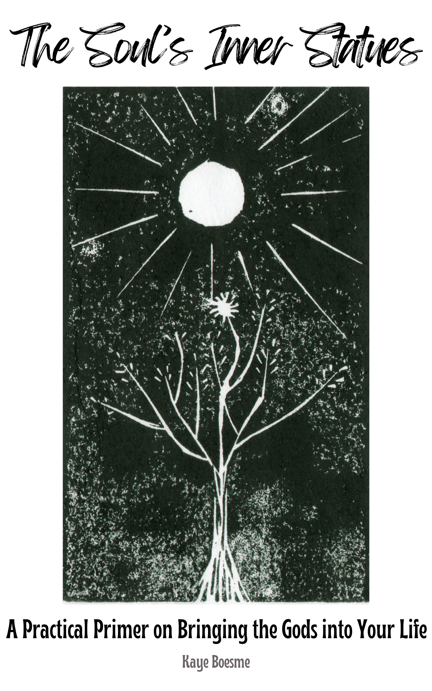

--- 
title: "The Soul's Inner Statues"
author: "Kaye Boesme"
date: "`r Sys.Date()`"
site: bookdown::bookdown_site
output: bookdown::gitbook
documentclass: book
# bibliography: [book.bib, packages.bib]
# biblio-style: apalike
# link-citations: yes
cover-image: soulsinnerstatues.png
github-repo: kayeofswords/soulsinnerstatues
description: "*The Soul’s Inner Statues is an open access primer on worshipping many Gods, combining theology and practice with foundational, actionable advice to get you started."
---

# Welcome!

*The Soul’s Inner Statues* is a practical guide for anyone looking to develop a solid spiritual practice and honor the Gods. This book takes you on a journey through the foundations of daily prayer, offering guidance on finding and honoring the Gods that resonate with you. It delves into contemplative practices, the essentials of building meaningful rituals, the importance of purification, and the role of the hearth and home in your spiritual practice. We will also discuss the importance of mindset, critical thinking, and lifelong learning. The author, raised in modern Neopaganism, takes a Platonizing approach to theology and bases the practical elements on her own lived experience. Whether you identify as pagan, polytheist, or simply a spiritual person seeking a deeper connection to something greater than yourself, *The Soul's Inner Statues* provides the tools you need to embark on a fulfilling spiritual journey through daily prayer and sustained connection to the Gods.

The book is based on blog posts, with additional information and contexts, on [KALLISTI](https://kallisti.blog), and on a blog of the same name that preexisted it. Most content was sourced from posts dating between 2009-2022. The public beta was released in March 2022 in a **public beta** stage, and revisions started on 1 July 2022. In late December 2022, the PDF was edited and formatted for the at-cost print edition, and no further changes are being made, barring the identification of typographic errors. Feedback may be directed to kallisti [@] fea [.] st. You can also [log an Issue in GitHub](https://github.com/kayeofswords/soulsinnerstatues/). The print version with ISBN 9781735740621 is out on February 27, 2023.

[You can download an ePub of this book (compatible with most eReading apps, including Google Play Books and Apple iBooks) here.](souls-inner-statues.epub)

There is a **well-formatted PDF** located [in the GitHub codebase](https://github.com/kayeofswords/soulsinnerstatues/tree/master/docs). You can also find other formats using the menu at the top of the page. **Please note that the section headers are different in the PDF and on the website due to the differences between how bookdown and LaTeX process section information. I recommend referring to sections by their name rather than number.**

## License and Reuse

 The Soul's Inner Statues by <a xmlns:cc="http://creativecommons.org/ns#" href="https://github.com/kayeofswords/soulsinnerstatues" property="cc:attributionName" rel="cc:attributionURL">Kaye Boesme</a> is licensed under a <a rel="license" href="http://creativecommons.org/licenses/by-nc-sa/4.0/">Creative Commons Attribution-NonCommercial-ShareAlike 4.0 International License</a>. This means that anyone can take this book (recommended: use the GitHub source code) and create a new book based on it as long as you share in kind. If you decide to do this, I recommend replacing first-person anecdotes in the book with your own or referring to me in the third person (i.e., “Kaye Boesme says that she …”).

